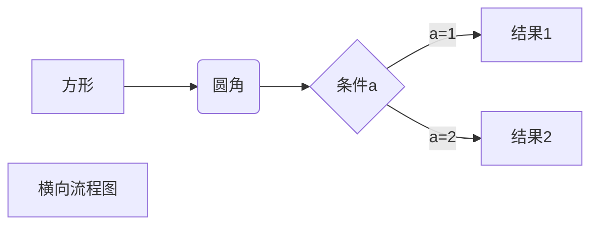
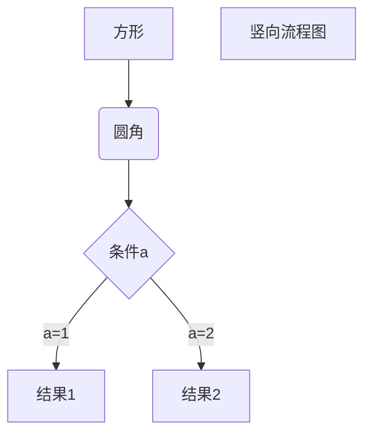
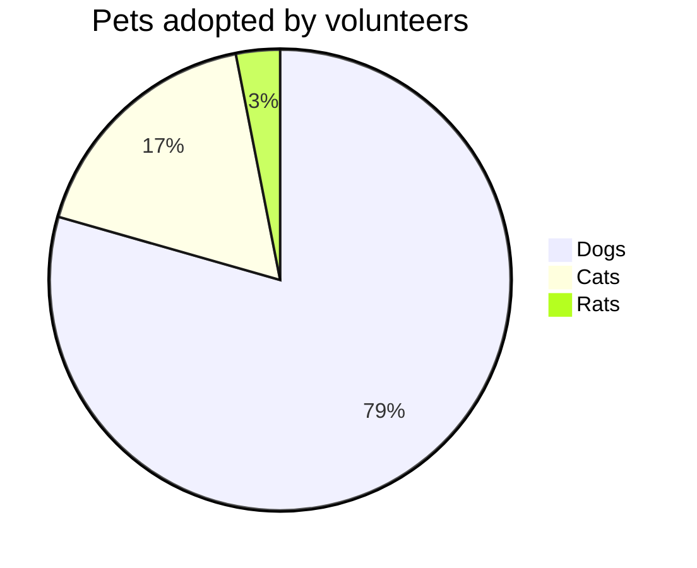
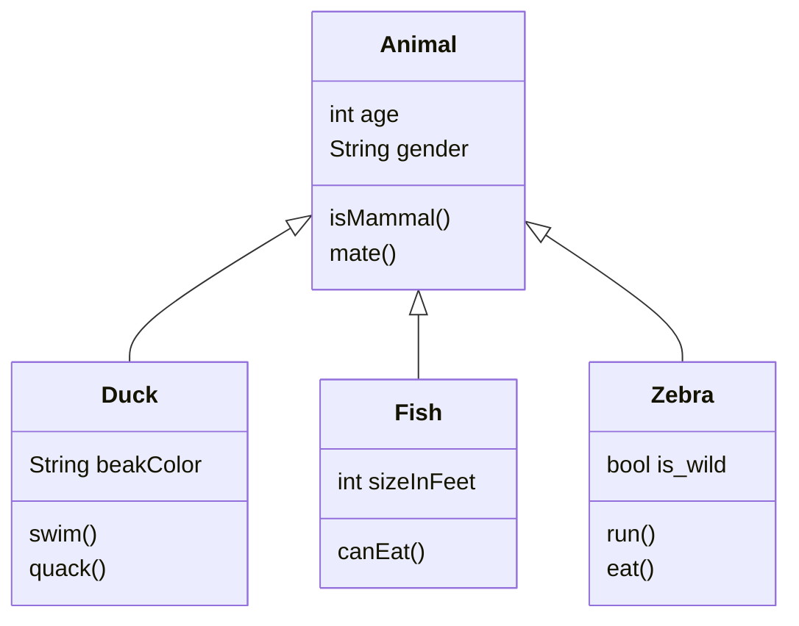

# Markdown 快速入门笔记

## 1. 最常用的代码块语法

### 例子
```html
<html>
    <head>
        <meta charset = "utf-8">
        <meta name="keywords" content="新手">
        <meta name="description" content="初学者制作的网页">
        <title>我的第一个网页</title>
        <link rel="shortcut icon" href="https://img.alicdn.com/tps/i3/T1OjaVFl4dXXa.JOZB-114-114.png" type="image/x-png">
    </head>
</html>
```
### 语法
\```内容\```

## 2. 关于标题的语法
```java
# 一级标题
## 二级标题
### 三级标题
#### 四级标题
##### 五级标题
###### 六级标题
再就没有了
想尝试下效果就把上面的复制粘贴出去
```

## 3. 字体
```java
//加粗
**污渍，永远滴神**
//删除线
~~lbwnb~~
//斜体
*wdnmd*
//加粗斜体
***lalala***
```

**污渍，永远滴神**  

~~lbwnb~~  

*wdnmd*  

***lalala***  


## 4. 引用

```java
> 小天天
>> lalalala
>>> hahahhaha
```

> 小天天
> > lalalala
> >
> > > hahahhaha


## 5. 分割线

```java
//分割线1
---
//分割线2
***
```

---


***


## 6. 图片插入

```java

```


路径也可以是网络图片，前提是你有网


## 7. 超链接

```java
[名字](路径)
<路径>
```

[本库地址](https://github.com/YukonChen/TiantianRepoForQNXG)


## 8. 列表

```java
//无序
- 标题1
- 标题2
    - 内容1
    - 内容2
//有序
1. 标题1
2. 标题2
    1. 内容1
    2. 内容2
```

- 标题1
- 标题2
    - 内容1
    - 内容2
1. 标题1
2. 标题2
    1. 内容1
    2. 内容2


## 9. 表格

```java
| 左对齐 | 右对齐 | 居中对齐 |
| :-----| ----: | :----: |
| 单元格 | 单元格 | 单元格 |
| 单元格 | 单元格 | 单元格 |
```

| 成绩 | 语文 | 数学 |
| :--: | :--: | :--: |
| 张三 | 242  | 131  |
| 张四 | 232  | 232  |
| 张五 | 241  | 442  |


## 10.  简单画图（进阶）

**1、横向流程图源码格式：**

```
​```mermaid
graph LR
A[方形] -->B(圆角)
    B --> C{条件a}
    C -->|a=1| D[结果1]
    C -->|a=2| E[结果2]
    F[横向流程图]
​```
```



**2、竖向流程图源码格式：**

```
​```mermaid
graph TD
A[方形] --> B(圆角)
    B --> C{条件a}
    C --> |a=1| D[结果1]
    C --> |a=2| E[结果2]
    F[竖向流程图]
​```
```



**3、标准流程图源码格式：**

```
​```flow
st=>start: 开始框
op=>operation: 处理框
cond=>condition: 判断框(是或否?)
sub1=>subroutine: 子流程
io=>inputoutput: 输入输出框
e=>end: 结束框
st->op->cond
cond(yes)->io->e
cond(no)->sub1(right)->op
​```
```

```flow
st=>start: 开始框
op=>operation: 处理框
cond=>condition: 判断框(是或否?)
sub1=>subroutine: 子流程
io=>inputoutput: 输入输出框
e=>end: 结束框
st->op->cond
cond(yes)->io->e
cond(no)->sub1(right)->op
```

**4、标准流程图源码格式（横向）：**

```
​```flow
st=>start: 开始框
op=>operation: 处理框
cond=>condition: 判断框(是或否?)
sub1=>subroutine: 子流程
io=>inputoutput: 输入输出框
e=>end: 结束框
st(right)->op(right)->cond
cond(yes)->io(bottom)->e
cond(no)->sub1(right)->op
​```
```

```flow
st=>start: 开始框
op=>operation: 处理框
cond=>condition: 判断框(是或否?)
sub1=>subroutine: 子流程
io=>inputoutput: 输入输出框
e=>end: 结束框
st(right)->op(right)->cond
cond(yes)->io(bottom)->e
cond(no)->sub1(right)->op
```

**5、饼图**

```
​```mermaid
    pie 
    title Pets adopted by volunteers
    "Dogs" : 386
    "Cats" : 85
    "Rats" : 15 
​```
```



**6、class类图**

```java
classDiagram
      Animal <|-- Duck
      Animal <|-- Fish
      Animal <|-- Zebra
      Animal : int age
      Animal : String gender
      Animal: isMammal()
      Animal: mate()
      class Duck{
          String beakColor
          swim()
          quack()
      }
      class Fish{
          int sizeInFeet
          canEat()
      }
      class Zebra{
          bool is_wild
          run()
          eat()
      }
```



还有其他不常用的图可以看下面的博客：  

<https://blog.csdn.net/weixin_38008864/article/details/106866122?%3E>


## 11. 内联LaTeX（高级进阶）

- Typora偏好中启用内联公式
- 可以输入数学公式
- 参考下面的文档
- [https://www.jianshu.com/p/e74eb43960a1]

$\sqrt x$ 举例子，就这样，所有数学公式几乎都能插入


