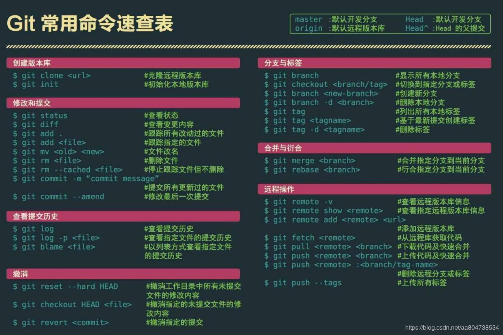
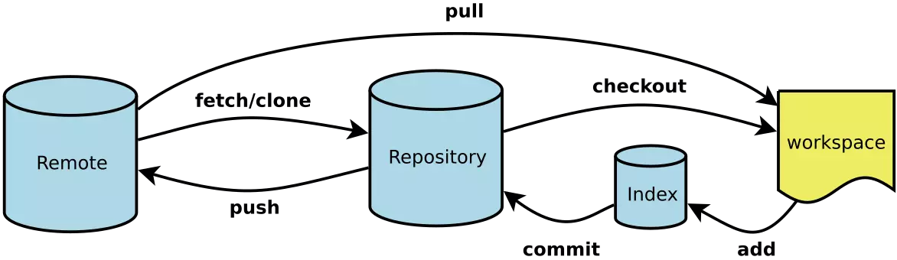
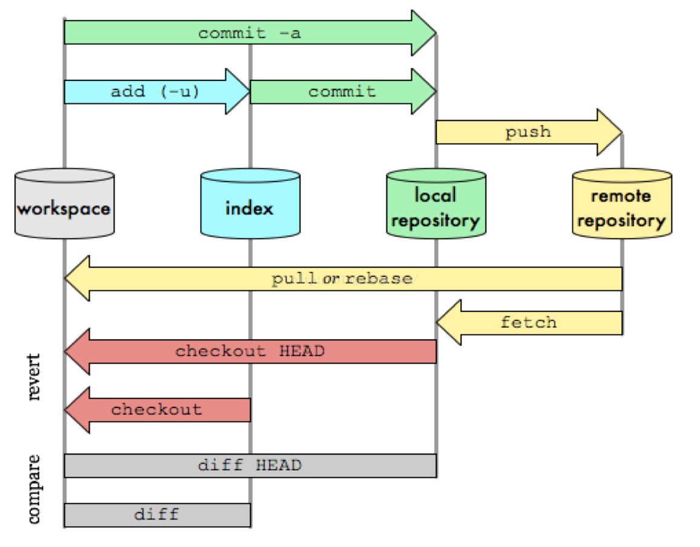

# Git深入学习

## 0. 命令速查

### 0.1. 表格



### 0.2. 最近指令

- `git push origin :refs/tags/v0.9`
  - 删除了v0.9的远程标签

## 1. 基本概念和工作原理

### 1.1 git基础概念

```
* 客户端并不只是提取最新版本的文件快照，而是把代码仓库完整的镜像下来
* git核心本质上是一个键值对数据库。可以向该数据库插入任意类型的内容，
  他会返回一个键值，通过该值可以在任意时刻再次检索该内容。
```

### 1.2 区域

```
* 工作区 （沙箱环境 git不会管理 随便更改操作）

* 暂存区  （记录文件的操作）

* 版本库   （最终的代码实现提交到这里 .git目录就是版本库）
```

### 1.3 .git目录下文件的介绍

```
* hooks (钩子函数的一个库 类似于回调函数)
* info (包含一个全局性的排除文件)
* objects (目录存储所有数据内容)
* refs (目录存储指向数据（分支）的提交对象的指针)
* config (文件包含项目特有的配置选项)
* description (显示对仓库的描述信息)
* HEAD (文件目前被检出的分支)
* logs (日志信息)
* index (文件保存暂存区的信息)
```

### 1.4 基础Linux命令

```
* clear 清除屏幕
* echo 'hello word '>test.tet 命令台书写内容
* ll 将当前目录下的子目录展现出来
* find ./ 将当前目录下的子目录以及文件也展现出来
* find ./ -type f 只讲文件展现出来
* rm text.txt 删除文件
* MV a.txt b.txt 更名字
* cat a.txt 查看文件内容
* vim a.txt 编辑内容 i 插入 ese : wq 保存退出 :set nu 设置行号 q! 强制退出不保存
```

### 1.5 对象

```
* Git对象
    - echo "hello" | git hash-object --stdin 
     - 这句命令返回一个hash值用来标识这句话 但是并没有写到数据库中  
     - 内容不一样对应的hash值不一样

    - echo "hello" | git hash-object -w --stdin
     - 这句命令返回一个hash值用来标识这句话 并写到数据库中  
     - 查看有没有存在 可以通过 find ./ -type f 找对应hash的文件
     - 里面的内容是压缩的 通过 git cat-file -p hash注意前面的那两个字母也加上
     - git cat-file -t hash 查看git对象的类型 blob

    - 将新创建的文件添加到git数据库中即生成一个git对象
     - git hash-object -w ./a.txt

    - 如果文件更改git数据库里面不会自动的添加要手动添加过去 这时会在添加一个git对象
     - git hash-object -w ./a.txt
    
    - 实质上Git对象是一个KYE：VALUE hash/value    
    - git对象不能当作项目的一次快照 只是组成项目的一部分

    - 存在的问题？
     - 记住文件的每一个（版本）对应的hash值并不现实
     - 在git中，文件名并没有被保存，只能通过hash

    - 注意：此时的操作只是针对本地数据库进行操作，不涉及暂存区。


* 树对象
    * 树对象能够解决文件名保存的问题，也允许我们将多个文件组织到一起。

    * 构建树对象
     - git update-index --add --cacheinfo 100644 915c628f360b2d8c3edbe1ac65cf575b69029b61 test.txt
     - 文件模式为100644 表明这是一个普通文件
     - 文件模式为100755 表明这是一个可执行文件
     - 文件模式为120000 表明这是一个符号连接
     -  --add 因为此前该文件并没有在暂存区中 首次要加add
     -  --cacheinfo 因为要添加的文件在git数据库中,没有位于当前目录下

    * 暂存区做一个快照生成一个对象放到git数据库中
     - git write-tree
        对象类型是一个树对象
        树对象里面的内容是暂存区的快照（项目的快照）
    * 暂存区中文件名字不变 如果改变文件的内容，就会重新生成一个hash

    * 存在的问题？
     - 不知道hash值对应的是哪一个版本
     - 不知道这个版本的一些基础信息    

* 提交对象    
    - 提交对象完美的解决了上面的问题
    - 本质就是给树对象做一层包裹包含项目的基础信息
    - commit-tree创建一个提交对象，为此需要指定一个树对象的hash值,以及该提交的父提交对象  
    - echo "second commit" | git commit-tree     019fb2c522b604cd94929085bbac93d60e2f2063 -p  d248eb19a125c

    - 真正代表一个项目的是一个提交对象（数据和基本信息）这是一个链式的！！ 
```

------

### 1.6 工作流原理图

### 





## 2. 基本命令

### 2.1 初始化git

```
* git init （初始化仓库 生成.git文件）
* git config --global user.name "Is zyd"
* git config --global user.email 1426593075@qq.com
* git config --list
```

### 2.2 添加到暂存区

```
* git add ./   首先将工作区（文件）做成git对象放到版本库 然后再放到暂存区 但是这里没有生成树对象
* git ls-files -s  查看暂存区的当前状态
```

### 2.3 添加到版本库

```
* git commit -m '提交的信息'
```

### 2.4 结论

```
* 一次完整的项目提交 包括至少一个提交对象 一个树对象 0或多个git对象
* 工作目录中文件只有两种状态 已跟踪（只要第一次add就跟踪上了） 未跟踪
* 已经跟踪的文件还有三种状态 已提交 已修改 已暂存
* 如果一个已经提交的文件再次修改要重新添加到暂存区否则显示已修改状态
* 如果一个文件暂存完了没有提交前还要在修改 这时会出现一个暂存一个已修改的情况需要重新add
* 
* 分支就是为了保护代码方便更改存在的 假如master里面的提交对象完美了就可以在创建一个分支   添加功能如果可以就可以master合并 不行的话就可以删除这个分支 这样对于master没有影响

* 新建一个分支到一个提交对象上面 这样做的好处是实现版本回推但是不改边主仓库的东西 用完    删除这个分支就可以了特别方便

* 合并分支一定要注意顺序 后面的可能会过期还会存在bug 会产生冲突
    - 快速合并 一条分支
    - 典型合并 多条分支 会有冲突（打开冲突文件看哪里要留 然后暂存提交）
    - 同事之间的冲突才是最麻烦的
```


## 3. 常用命令

#### 3.1 初始化仓库

创建工作区域

```
# case1
# 在当前目录创建一个文件夹
$ mkdir [project-name]
# 在当前目录新建一个Git代码库
$ git init
# case2
# 新建一个目录，将其初始化为Git代码库
$ git init [project-name]
# case3
# 下载一个项目和它的整个代码历史（各个分支提交记录等）
$ git clone [url]

复制代码
```

#### 3.2 增加/删除文件

结合上面的原理图，去理解常用的 add commit 命令

```
# 添加指定文件到暂存区
$ git add [file1] [file2] ...

# 添加指定目录到暂存区，包括子目录
$ git add [dir]

# 添加当前目录的所有文件到暂存区
$ git add .

# 添加每个变化前，都会要求确认
# 对于同一个文件的多处变化，可以实现分次提交
$ git add -p

# 删除工作区文件，并且将这次删除放入暂存区
$ git rm [file1] [file2] ...

# 停止追踪指定文件，但该文件会保留在工作区
$ git rm --cached [file]

# 改名文件，并且将这个改名放入暂存区
$ git mv [file-original] [file-renamed]

# 提交暂存区到仓库区
$ git commit -m [message]

# 提交暂存区的指定文件到仓库区
$ git commit [file1] [file2] ... -m [message]

# 提交工作区自上次commit之后的变化，直接到仓库区
$ git commit -a

# 提交时显示所有diff信息
$ git commit -v

# 使用一次新的commit，替代上一次提交
如果代码没有任何新变化，则用来改写上一次commit的提交信息
$ git commit --amend -m [message]

# 重做上一次commit，并包括指定文件的新变化
$ git commit --amend [file1] [file2] ...

# 提交更改到远程仓库
$ git push origin master

# 拉取远程更改到本地仓库默认自动合并
$ git pull origin master
复制代码
```

#### 3.3 查看信息

我们可以看当前 git 状态，提交日志，文件差异等待内容

```
# 显示有变更的文件
$ git status

# 显示当前分支的版本历史
$ git log

# 显示commit历史，以及每次commit发生变更的文件
$ git log --stat

# 搜索提交历史，根据关键词
$ git log -S [keyword]

# 显示某个commit之后的所有变动，每个commit占据一行
$ git log [tag] HEAD --pretty=format:%s

# 显示某个commit之后的所有变动，其"提交说明"必须符合搜索条件
$ git log [tag] HEAD --grep feature

# 显示某个文件的版本历史，包括文件改名
$ git log --follow [file]
$ git whatchanged [file]

# 显示指定文件相关的每一次diff
$ git log -p [file]

# 显示过去5次提交
$ git log -5 --pretty --oneline

# 显示所有提交过的用户，按提交次数排序
$ git shortlog -sn

# 显示指定文件是什么人在什么时间修改过
$ git blame [file]

# 显示暂存区和工作区的差异
$ git diff

# 显示暂存区和上一个commit的差异
$ git diff --cached [file]

# 显示工作区与当前分支最新commit之间的差异
$ git diff HEAD

# 显示两次提交之间的差异
$ git diff [first-branch]...[second-branch]

# 显示今天你写了多少行代码
$ git diff --shortstat "@{0 day ago}"

# 显示某次提交的元数据和内容变化
$ git show [commit]

# 显示某次提交发生变化的文件
$ git show --name-only [commit]

# 显示某次提交时，某个文件的内容
$ git show [commit]:[filename]

# 显示当前分支的最近几次提交
$ git reflog
复制代码
```

#### 3.4 标签

标签其实是一种版本的概念，发布一个版本时，我们通常先在版本库中打一个标签（tag），这样，就唯一确定了打标签时刻的版本。

commit号一般长这样6a5819e...，比如你要回退到这个版本，你记得住6a5819e...吗？这时候标签就起作用了。

```
# 列出所有tag
$ git tag

# 新建一个tag在当前commit
$ git tag [tag]

# 新建一个tag在指定commit
$ git tag [tag] [commit]

# 删除本地tag
$ git tag -d [tag]

# 删除远程tag
$ git push origin :refs/tags/[tagName]

# 查看tag信息
$ git show [tag]

# 提交指定tag
$ git push [remote] [tag]

# 提交所有tag
$ git push [remote] --tags

# 新建一个分支，指向某个tag
$ git checkout -b [branch] [tag]
复制代码
```

#### 3.5 分支管理

分支其实是一种并行开发（协作）的方式，可以在不同的分支上干各自是事。

```
# 列出所有本地分支
$ git branch

# 列出所有远程分支
$ git branch -r

# 列出所有本地分支和远程分支
$ git branch -a

# 新建一个分支，但依然停留在当前分支
$ git branch [branch-name]

# 新建一个分支，并切换到该分支
$ git checkout -b [branch]

# 新建一个分支，指向指定commit
$ git branch [branch] [commit]

# 新建一个分支，与指定的远程分支建立追踪关系
$ git branch --track [branch] [remote-branch]

# 切换到指定分支，并更新工作区
$ git checkout [branch-name]

# 切换到上一个分支
$ git checkout -

# 建立追踪关系，在现有分支与指定的远程分支之间
$ git branch --set-upstream [branch] [remote-branch]

# 合并指定分支到当前分支
$ git merge [branch]

# 选择一个commit，合并进当前分支
$ git cherry-pick [commit]

# 删除分支
$ git branch -d [branch-name]

# 删除远程分支
$ git push origin --delete [branch-name]
$ git branch -dr [remote/branch]

复制代码
```

#### 3.6 撤销（俗称后悔药）

咱们干活不是只能往前走，偶尔我们可能会需要回到之前的版本，那这个时候撤销命令就上场了

```
# 恢复暂存区的指定文件到工作区
$ git checkout [file]

# 恢复某个commit的指定文件到暂存区和工作区
$ git checkout [commit] [file]

# 恢复暂存区的所有文件到工作区
$ git checkout .

# 重置暂存区的指定文件，与上一次commit保持一致，但工作区不变
$ git reset [file]

# 重置暂存区与工作区，与上一次commit保持一致
$ git reset --hard

# 重置当前分支的指针为指定commit，同时重置暂存区，但工作区不变
$ git reset [commit]

# 重置当前分支的HEAD为指定commit，同时重置暂存区和工作区，与指定commit一致
$ git reset --hard [commit]

# 重置当前HEAD为指定commit，但保持暂存区和工作区不变
$ git reset --keep [commit]

# 新建一个commit，用来撤销指定commit
# 后者的所有变化都将被前者抵消，并且应用到当前分支
$ git revert [commit]

# 暂时将未提交的变化移除，稍后再移入
$ git stash
$ git stash pop
```
## 4. Git 结合Github

### 4.1 创建远程库地址别名

~~~
git remote -v  #查看远程地址别名
git remote add 别名 远程地址 
例子：git remote add origin https://xx
~~~

### 4.2 推送

`开发修改完把本地库的文件推送到远程仓库` `前提是提交到了本地库才可以推送`

~~~
git push 别名 分支名
git push -u 别名 分支名    #-u指定默认主机
例子：git push origin master
~~~

### 4.3 克隆

`完整的把远程库克隆到本地`  `克隆下来后不要在主分支里面做开发` `clone进行一次，从无到有的过程，更新用pull`

~~~
git clone  远程地址
例子：git clone https://xx
~~~

### 4.4 拉取

  `本地存在clone下来的文件  就用pull更新`  

```
pull = fetch + merge
	git fetch 别名 分支名
	git merge 别名 分支名
git pull 别名 分支名
```

### 4.5 解决冲突

`注意：解决冲突后的提交是不能带文件名的`

`如果不是基于远程库最新版做的修改不能推送，必须先pull下来安装冲突办法解决`

### 4.6 rebase

```
git rebase -i 索引号
git rebase -i HEAD~3  #合并最近三条记录
说明：在vim编辑里面改成s
```

### 4.7 beyond compare 

 ```
1.安装 ：
	beyond compare 
2.配置：
    git config --local merge.tool bc3  #合并名称
    git config --local mergetool.path '/usr/local/bin/bcomp' #软件路径
    git config --local mergetool.keepBackup false  #False不用保存备份
3.应用：
	git mergetool
说明：--local指只在当前操作系统有效
 ```

### 4.8 跨团队合作

`代码review之后合并`

- **适用于个人**

  **邀请成员**:`Settings` --> `Collaborators` -->`填写用户名` -->`打开链接接受邀请`

- **企业**   `创建一个组织` `方便管理`

- **review**

    `组织做review`  `通过Pull request`

- **给开源社区共享代码**

    `点击别人仓库的fork 到自己的仓库`   -- > `然后clone下来 修改后推送到远程库`  --> `点击Pull Request请求` --> `Create pull request发消息`

### 4.9 Tag标签

`为了清晰的版本管理，公司一般不会直接使用commit提交`

```
git tag -a v1.0 -m '版本介绍'   #创建本地tag信息
git tag -d v1.0    		#删除tag
git push origin --tags   #将本地tag信息推送到远程库
git pull origin --tags    #拉取到本地

git checkout v.10    #切换tag
git clone -b v0.1 地址   #指定tag下载代码
```

### 4.10 SSH 免密登录

- 输入:`ssh-keygen -t rsa -C GitHub邮箱地址`  
- 进入`.ssh`目录，复制`id_rsa.pub`文件内容
- 登录GitHub。`Settings`  --> `SSH and GPG keys ` --> `New SSH Key    `
- 回到git通过ssh地址创建。`git remote add 别名 SSH地址  `

## 5. Git工作流

### 5.1 概念

```
在项目开发过程中使用Git的方式
```

### 5.2 分类

#### 5.2.1 集中式工作流

```
像SVN一样，集中式工作流有一个中央仓库，所有的修改都提交到了Master分支上
```

#### 5.2.2 GitFlow工作流 （重要）

主干分支`master`  开发分支`develop`  修复分支`hotfix`   预发布分支`release`  功能分支`feature`

```
GitFlow 有独立的分支，让发布迭代过程更流畅。
```

#### 5.2.3 Forking 工作流    

```
在 GitFlow 基础上， 充分利用了 Git 的 Fork 和 pull request 的功能以达到代码审核的目的。 
安全可靠地管理大团队的开发者
```

